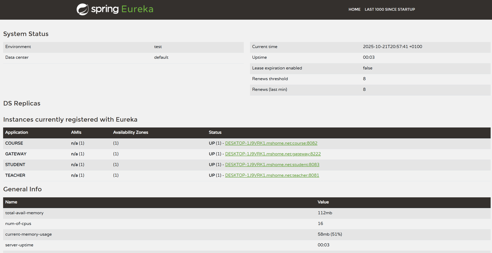
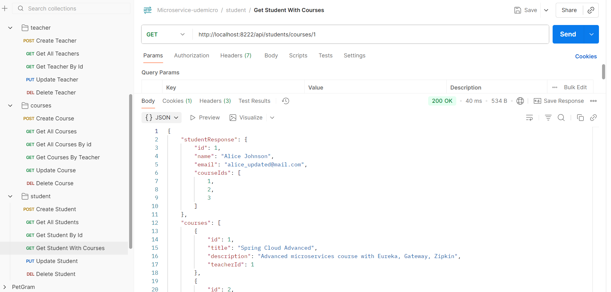
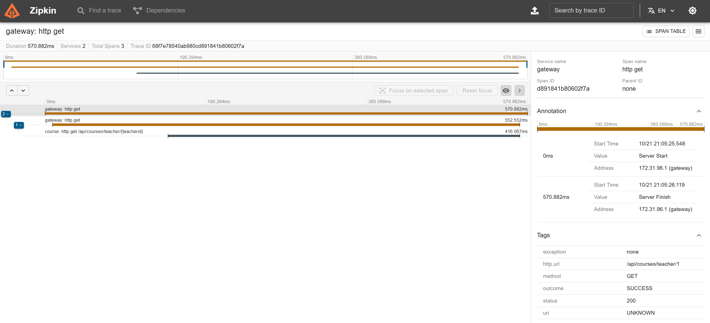
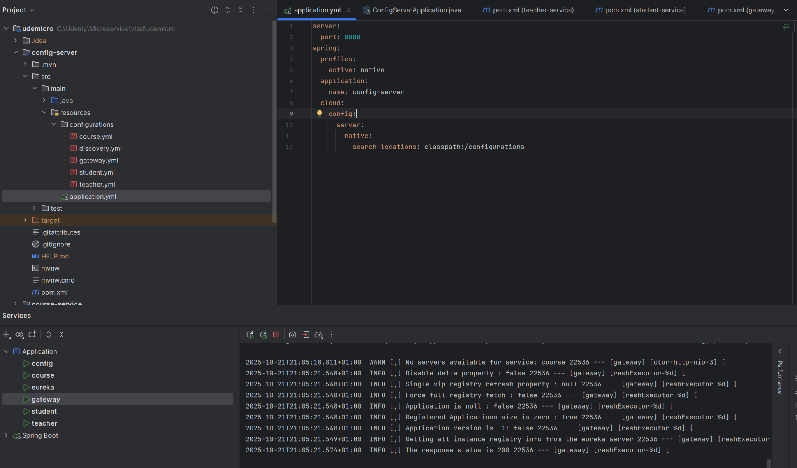

# 🧩 Udemicro — Spring Boot Microservice Architecture

This project demonstrates a **complete microservices ecosystem** built with **Spring Boot 3**, **Spring Cloud**, and **distributed tracing via Zipkin**.  
It was developed as part of my journey to **master microservices architecture** — including **service discovery, centralized configuration, API gateway routing**, and **inter-service communication using Feign**.

---

## 🖼️ Project Screenshots

| Eureka | Postman | Zipkin | Config Server |
|:------:|:--------:|:------:|:--------------:|
|  |  |  |  |

---

## 🚀 Overview

The system consists of **three independent microservices** — `Teacher Service`, `Course Service`, and `Student Service`,  
plus **infrastructure services** — `Eureka`, `Config Server`, `Gateway`, and `Zipkin`.

Each service is **self-contained**, **registered automatically** in Eureka, and **communicates through Feign clients**.

---

## 🧱 Architecture Summary

| Component | Description |
|------------|-------------|
| 🧭 **Eureka Discovery Server** | Registers all services and enables inter-service communication via service names instead of hardcoded URLs. |
| ⚙️ **Config Server** | Provides centralized configuration for all services from `/configurations` folder. |
| 🌍 **Gateway** | Routes external requests to internal microservices using load-balanced routes. |
| 🎓 **Teacher Service** | CRUD microservice managing teacher data (id, name, subject, email). |
| 📘 **Course Service** | CRUD microservice managing courses; validates teacher existence via Feign call to Teacher Service. |
| 👩‍🎓 **Student Service** | CRUD microservice managing students; aggregates data from Course Service using Feign (API Composition pattern). |
| 🔍 **Zipkin** | Distributed tracing and monitoring across all services. |

---

## ⚡ Technologies Used

| Category | Stack |
|-----------|-------|
| **Core Framework** | Spring Boot 3.5.x, Java 21 |
| **Spring Cloud** | Eureka, Gateway, Config Server, OpenFeign |
| **Database** | MySQL + Spring Data JPA |
| **Tracing** | Micrometer + Sleuth + Zipkin |
| **Testing** | Postman |
| **Build Tool** | Maven |
| **IDE** | IntelliJ IDEA Ultimate |

---

## 🧩 Microservices Interaction

### ➤ Teacher Service
- Provides endpoints for creating, updating, and listing teachers.
- Registered as **`TEACHER`** in Eureka.

### ➤ Course Service
- Creates and lists courses.
- Uses **Feign Client** to call `Teacher Service` to verify teacher existence before saving a course.
- Implements `getAllCoursesByTeacherId()` to fetch teacher + courses data.

### ➤ Student Service
- Manages students and their enrolled courses.
- Uses **Feign Client** to call `Course Service` and aggregate data:
    - Student info
    - List of all their courses
- Implements `getStudentWithCourses()` for combined response.

---

## 🧠 Example Feign Integration

In **Course Service**:
```java
@FeignClient(name = "teacher")
public interface TeacherClient {
    @GetMapping("/api/teachers/{id}")
    TeacherResponse getTeacherById(@PathVariable Long id);
}
```

In **Student Service**:
```java
@FeignClient(name = "course")
public interface CourseClient {
    @GetMapping("/api/courses/{id}")
    CourseResponse getCourse(@PathVariable Long id);
}
```

These clients allow microservices to communicate seamlessly via **Eureka** without direct URLs.

---

## 🔗 Example Request Flow

**GET** → `http://localhost:8222/api/students/courses/1`

1️⃣ Request enters through **Gateway (8222)**  
2️⃣ Routed to **Student Service (8083)**  
3️⃣ Student Service calls **Course Service (8082)** via **Feign**  
4️⃣ Course Service validates **Teacher (8081)**  
5️⃣ Aggregated response is returned  
6️⃣ **Zipkin** traces the entire journey 🎯

**Response Example:**
```json
{
  "studentResponse": {
    "id": 1,
    "name": "Alice Johnson",
    "email": "alice_updated@mail.com",
    "courseIds": [1, 2, 3]
  },
  "courses": [
    {
      "id": 1,
      "title": "Spring Cloud Advanced",
      "description": "Advanced microservices course with Eureka, Gateway, Zipkin",
      "teacherId": 1
    }
  ]
}
```

---

## 🧭 Ports Overview

| Service | Port |
|----------|------|
| Config Server | 8888 |
| Eureka Server | 8761 |
| Gateway | 8222 |
| Teacher Service | 8081 |
| Course Service | 8082 |
| Student Service | 8083 |
| Zipkin | 9411 |

---

## 🧰 Run Order

1. ⚙️ **Config Server**
2. 🧭 **Eureka Discovery Server**
3. 🎓 **Teacher Service**
4. 📘 **Course Service**
5. 👩‍🎓 **Student Service**
6. 🌍 **Gateway**
7. 🔍 **Zipkin**

---

## 🎯 Key Microservice Concepts Covered

✅ **Service Registration & Discovery** — via Eureka  
✅ **Centralized Configuration Management** — via Config Server  
✅ **API Gateway Routing** — via Spring Cloud Gateway  
✅ **Inter-service Communication** — via Feign Clients  
✅ **Distributed Tracing & Monitoring** — via Sleuth + Zipkin  
✅ **API Composition Pattern** — in Student Service

---

## ❤️ Author

**Vlad RaxRot**  
🎓 Backend Developer learning advanced **Spring Boot Microservices Architecture**  
💡 Building full microservice ecosystems with **Eureka**, **Gateway**, **Config Server**, and **Zipkin**.

---

✨ *Fully working microservice system with tracing, service discovery, and centralized configuration — built from scratch.*
